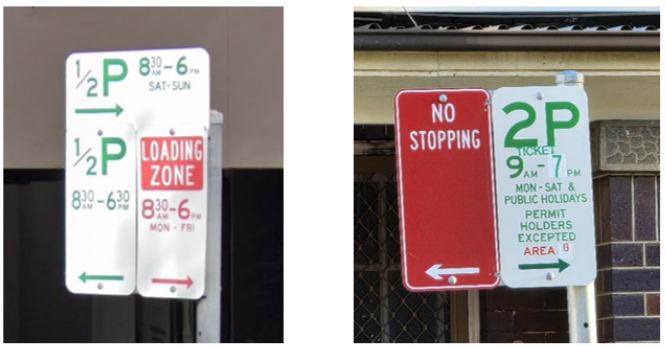
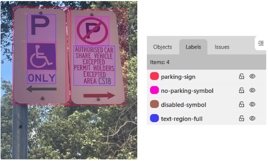
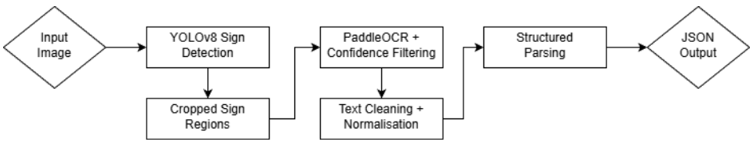
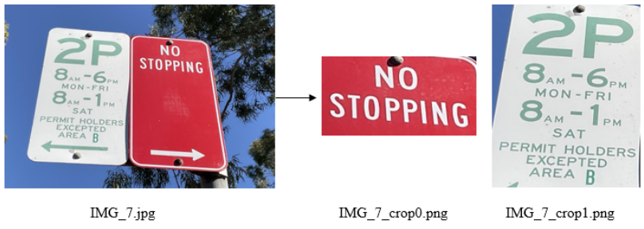
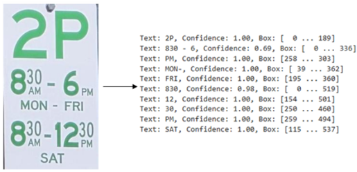
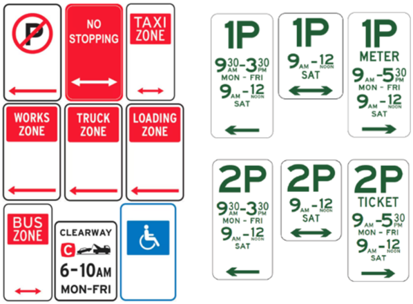

# Australian Parking Sign Detection and Structured Information Extraction

Code for my Master of Data Science capstone project on detecting Australian parking signs and converting their information into structured JSON.

The project combines YOLOv8 for sign and symbol detection, PaddleOCR for text extraction and rule-based parsing for interpreting parking restrictions. The repository contains the code and outputs used for the project; it is not intended as a standalone package.

## Dependencies

The notebook uses Python and the following packages:

- `ultralytics`
- `paddleocr`
- `paddlepaddle`
- `Pillow`
- `matplotlib`
- `numpy`
- `pandas`

## Dataset

The full dataset is not included in this repository. The dataset consists of collected and annotated Australian parking sign images. The annotations were completed using [Computer Vision Annotation Tool](https://www.cvat.ai/) (CVAT). In total, there were 206 training images and 84 validation images (field photographs), with 85 test Google Street View (GSV) images. Contact the author for information regarding dataset access.

## Notes

The [trained model](runs\detect\train\weights\best.pt) needs to be retrained with the following augmentation settings in model.train() as this has confused the OCR results. This subsequently led to poor accuracy for some parking sign interpretation.

```
fliplr=0.0,  # disable horizontal flip
flipud=0.0   # disable vertical flip
```

## Figures

  
Figure 1. Example of images from GSV (left) and field photography (right). 

  
Figure 2. Annotated parking sign image alongside the four bounding box categories.

  
Figure 3. End-to-end workflow of the pipeline for interpretation of parking signs.

  
Figure 4. Example parking sign with cropped text regions.

  
Figure 5. Example of plain PaddleOCR text, confidence and bounding box output.

  
Figure 6. Some examples of NSW parking-related signs in scope for this project ([Transport for NSW](https://www.nsw.gov.au/driving-boating-and-transport/roads-safety-and-rules/parking)).